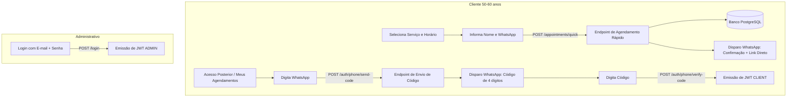

# Especificação Técnica: Agendamento Rápido e Autenticação Sem Senhas (WhatsApp)

Esta documentação técnica descreve a arquitetura, modelagem de dados, contratos de API, regras de negócio e a decomposição modular para implementação do **Agendamento Rápido (*Guest Checkout*)** e da **Autenticação Sem Senhas (*Passwordless OTP via WhatsApp*)** no sistema `agendamento-api`.

O objetivo primário é eliminar qualquer atrito de cadastro/senhas para clientes (público de 50 a 60 anos), preservando a segurança, integridade dos dados e conformidade com a LGPD.

---

## 1. Visão Geral da Arquitetura

O sistema passará a operar com dois modelos complementares de interação para o cliente final:

1. **Jornada de Criação (Guest Checkout):**
   * O cliente final agenda um procedimento sem autenticação prévia, informando apenas **Nome** e **WhatsApp**.
   * A API cria ou vincula o cliente pelo telefone, persiste o agendamento e dispara automaticamente uma mensagem no WhatsApp com a confirmação e um link seguro com token único de consulta/gerenciamento.
2. **Jornada de Acesso Posterior (Passwordless WhatsApp OTP):**
   * Caso o cliente deseje consultar histórico ou remarcar diretamente pelo site, informa apenas seu WhatsApp.
   * O sistema envia um código numérico de 4 a 6 dígitos (ou link de 1 clique) via WhatsApp.
   * Ao validar o código, a API emite o token JWT com `role: CLIENT`.
3. **Jornada Administrativa:**
   * Usuários com perfil `ADMIN` (recepcionistas, administradores e profissionais) continuam utilizando o fluxo tradicional com e-mail e senha forte.



---

## 2. Modelagem de Dados e Banco de Dados (TypeORM)

### 2.1. Alterações na Entidade `User` (`src/entities/user.ts`)

| Campo | Tipo Anterior | Novo Tipo | Nulo? | Regra / Descrição |
| :--- | :--- | :--- | :--- | :--- |
| `phone` | `varchar(20)` | `varchar(20)` | **Não** | Indexado. Normalizado no formato internacional/E.164 (ex: `+5511999999999`). Chave de busca principal para clientes. |
| `email` | `varchar(100)` | `varchar(100)` | **Sim** | Opcional para clientes (`CLIENT`), obrigatório para administradores (`ADMIN`). Índice único condicional ou não nulo. |
| `password_hash`| `varchar` | `varchar` | **Sim** | Opcional para clientes (`CLIENT`), obrigatório para `ADMIN`. |
| `role` | `enum (ADMIN, CLIENT)`| `enum` | **Não** | Inalterado. Padrão: `CLIENT`. |

### 2.2. Nova Entidade: `PhoneAuthCode` (`src/entities/phoneAuthCode.ts`)

Armazena códigos temporários enviados para validação de telefone.

```typescript
@Entity("phone_auth_codes")
export class PhoneAuthCode {
  @PrimaryGeneratedColumn("uuid")
  id: string;

  @Column({ type: "varchar", length: 20 })
  phone: string;

  @Column({ type: "varchar" })
  code_hash: string; // Hash seguro (SHA-256 ou Argon2) para não salvar código em texto plano

  @Column({ type: "timestamp" })
  expires_at: Date; // TTL padrão: 10 minutos

  @Column({ type: "boolean", default: false })
  verified: boolean;

  @Column({ type: "int", default: 0 })
  attempts: number; // Controle de tentativas para proteção anti-brute force (máx 3 a 5)

  @CreateDateColumn()
  created_at: Date;
}
```

### 2.3. Alterações na Entidade `Appointment` (`src/entities/appointment.ts`)

Para permitir que o cliente consulte, cancele ou remarque seu agendamento através do link recebido no WhatsApp sem exigir login formal:

* Adicionar coluna `manage_token`: `varchar(64)`, indexado, único, gerado via `crypto.randomBytes(32).toString('hex')`.
* Permite acesso seguro e individualizado ao agendamento pelo link: `https://clinica.com.br/agendamento/:manage_token`.

---

## 3. Camada de Integração de Mensageria (WhatsApp Service Adapter)

Para desacoplar a regra de negócio do provedor de WhatsApp (Evolution API, Z-API, Twilio ou Meta Cloud API), deve-se adotar o padrão **Adapter/Interface**.

### 3.1. Interface `IMessagingService`

```typescript
export interface SendOtpDTO {
  phone: string;
  code: string;
}

export interface SendAppointmentConfirmationDTO {
  phone: string;
  clientName: string;
  serviceName: string;
  appointmentDate: Date;
  manageLink: string;
}

export interface IMessagingService {
  sendOtpCode(data: SendOtpDTO): Promise<void>;
  sendAppointmentConfirmation(data: SendAppointmentConfirmationDTO): Promise<void>;
}
```

### 3.2. Implementações Planejadas
* **`MockMessagingService`**: Grava os envios no console/logs para ambiente de desenvolvimento local e testes automatizados.
* **`WhatsAppProviderService`**: Faz requisições HTTP para a API de WhatsApp escolhida via variáveis de ambiente (`WHATSAPP_API_URL`, `WHATSAPP_API_KEY`, etc.).

---

## 4. Contratos de API (Especificação de Endpoints)

---

### Endpoint 4.1: `POST /appointments/quick`
* **Descrição:** Criação de agendamento em fluxo aberto (Guest Checkout).
* **Autenticação:** Nenhuma (Público).
* **Payload de Entrada (Request Body):**

```json
{
  "name": "Maria Silva",
  "phone": "11987654321",
  "service_id": "8b5258e2-b883-4ee1-b0db-6e65bfb3c1d2",
  "service_date": "2026-10-20T14:00:00.000Z"
}
```

* **Respostas:**
  * `201 Created`:
    ```json
    {
      "appointment_id": "c1a938c5-e517-4952-b8bb-0a7586fa6e12",
      "service_date": "2026-10-20T14:00:00.000Z",
      "appointment_status": "CONFIRMED",
      "manage_token": "a1b2c3d4e5f6...",
      "client": {
        "user_id": "f5e4d3c2-b1a0-...",
        "name": "Maria Silva",
        "phone": "+5511987654321"
      },
      "service": {
        "service_id": "8b5258e2-b883-...",
        "name": "Limpeza de Pele Profunda",
        "price": 180.0,
        "duration_minutes": 60
      }
    }
    ```
  * `400 Bad Request`: Validação de esquema inválida (telefone inválido, data no passado).
  * `409 Conflict`: Conflito de agenda (horário já ocupado pelo profissional/serviço).

---

### Endpoint 4.2: `POST /auth/phone/send-code`
* **Descrição:** Dispara um código OTP de 4 a 6 dígitos para o WhatsApp do cliente.
* **Autenticação:** Nenhuma (Público com Rate Limit).
* **Payload de Entrada (Request Body):**

```json
{
  "phone": "11987654321"
}
```

* **Respostas:**
  * `200 OK`:
    ```json
    {
      "message": "Código de verificação enviado com sucesso para o WhatsApp.",
      "expires_in_seconds": 600
    }
    ```
  * `429 Too Many Requests`: Limite de requisições excedido (cooldown de 60 segundos não respeitado ou excesso de pedidos por hora).
  * `400 Bad Request`: Número de telefone em formato inválido.

---

### Endpoint 4.3: `POST /auth/phone/verify-code`
* **Descrição:** Valida o código recebido via WhatsApp e autentica o usuário, emitindo JWT. Se o usuário ainda não existir no sistema, ele é criado automaticamente.
* **Autenticação:** Nenhuma (Público).
* **Payload de Entrada (Request Body):**

```json
{
  "phone": "11987654321",
  "code": "8492"
}
```

* **Respostas:**
  * `200 OK`:
    ```json
    {
      "token": "eyJhbGciOiJIUzI1NiIsInR5cCI6IkpXVCJ9...",
      "user": {
        "user_id": "f5e4d3c2-b1a0-...",
        "name": "Maria Silva",
        "phone": "+5511987654321",
        "role": "CLIENT"
      }
    }
    ```
  * `400 Bad Request`: Código incorreto ou expirado. Retorna tentativas restantes.
  * `403 Forbidden`: Número de tentativas excedido (código bloqueado/invalidado).

---

### Endpoint 4.4: `GET /appointments/guest/:manage_token`
* **Descrição:** Permite que o cliente visualize os detalhes do agendamento específico através do link recebido no WhatsApp, sem precisar fazer login.
* **Autenticação:** Token na URL (`manage_token`).
* **Respostas:**
  * `200 OK`: Retorna detalhes do agendamento, status, data, serviço e profissional.
  * `404 Not Found`: Token inexistente ou inválido.

---

### Endpoint 4.5: `PATCH /appointments/guest/:manage_token/cancel`
* **Descrição:** Permite cancelar o agendamento através do link do WhatsApp respeitando as regras de cancelamento da clínica (ex: antecedência mínima de 2 horas).
* **Autenticação:** Token na URL (`manage_token`).
* **Respostas:**
  * `200 OK`: Status alterado para `CANCELED`.
  * `400 Bad Request`: Cancelamento fora da janela permitida.

---

## 5. Módulos de Desenvolvimento e Decomposição de Tarefas

---

### Módulo 1: Modelagem e Persistência de Dados
*Objetivo:* Adequar o esquema do banco de dados para suportar usuários sem e-mail/senha, controle de códigos temporários e tokens de gerenciamento de agendamento.

* **Tarefa 1.1: Adaptação da Entidade User e Migração TypeORM**
  * Alterar `email` e `password_hash` para `nullable: true`.
  * Tornar `phone` obrigatório e indexado.
  * Gerar e testar migração TypeORM correspondente.
  * *Critério de Aceite:* Possibilidade de salvar um registro de `User` com apenas `name`, `phone` e `role: CLIENT` sem erros de restrição no PostgreSQL.

* **Tarefa 1.2: Criação da Entidade `PhoneAuthCode` e Migração**
  * Criar entidade com colunas `id`, `phone`, `code_hash`, `expires_at`, `verified`, `attempts` e `created_at`.
  * Adicionar índices em `phone` e `expires_at`.
  * Gerar e executar a migração.
  * *Critério de Aceite:* Tabela `phone_auth_codes` criada no banco com os tipos e restrições corretos.

* **Tarefa 1.3: Campo `manage_token` na Entidade `Appointment`**
  * Adicionar coluna `manage_token` na entidade `Appointment`.
  * Gerar valor randômico criptográfico no momento da criação.
  * Gerar e executar migração.
  * *Critério de Aceite:* Todo novo agendamento possui um `manage_token` único de 64 caracteres hexadecimais.

---

### Módulo 2: Serviço de Mensageria e Normalização de Telefones
*Objetivo:* Estruturar os utilitários de tratamento de telefone e a camada de envio de mensagens para desacoplar a regra de negócio do provedor de WhatsApp.

* **Tarefa 2.1: Utilitário de Normalização e Validação de Telefones (Helper)**
  * Criar função utilitária `normalizePhoneNumber(rawPhone: string): string` que remove caracteres especiais e formata no padrão E.164 brasileiro (`+55DD9XXXXXXXX`).
  * Validar DDDs válidos e nono dígito obrigatório para celulares.
  * Criar testes unitários para o helper com diversos formatos de entrada (`(11) 98765-4321`, `11987654321`, `+55 11 98765-4321`).
  * *Critério de Aceite:* Qualquer telefone válido brasileiro é sanitizado para o formato `+55XXXXXXXXXXX` de forma determinística.

* **Tarefa 2.2: Contrato e Mock do Provedor de Mensageria**
  * Definir a interface `IMessagingService`.
  * Implementar `MockMessagingService` que armazena as mensagens em memória ou loga no console em ambiente de desenvolvimento/teste.
  * *Critério de Aceite:* O sistema pode executar o fluxo de envio sem falhar quando nenhuma API externa de WhatsApp estiver configurada.

* **Tarefa 2.3: Implementação do Provedor HTTP para WhatsApp API**
  * Implementar adapter HTTP configurável para disparo de mensagens reais (via Evolution API, Z-API ou Meta Cloud API).
  * Carregar chaves e URLs a partir das variáveis de ambiente (`.env`).
  * Adicionar tratamento de falha na entrega de mensagens sem derrubar a transação principal do agendamento.
  * *Critério de Aceite:* Disparo de requisição HTTP autenticada para o gateway com template de texto amigável e legível.

---

### Módulo 3: Feature de Agendamento Rápido (Guest Checkout)
*Objetivo:* Permitir a criação de agendamento simplificado sem necessidade de login prévio, associando o usuário por telefone e confirmando via WhatsApp.

* **Tarefa 3.1: Esquema de Validação Zod para Agendamento Rápido**
  * Criar `quickAppointmentSchema` validando `name` (mínimo 2 caracteres), `phone` (telefone válido), `service_id` (UUID) e `service_date` (data futura válida).
  * *Critério de Aceite:* Rejeitar requisições com dados inconsistentes retornando mensagens de erro amigáveis em português.

* **Tarefa 3.2: Lógica de Negócio do Agendamento Rápido (`QuickAppointmentService`)**
  * Normalizar telefone do cliente.
  * Verificar se o cliente já existe por `phone`. Se sim, utilizar a entidade existente (atualizando o nome se aplicável). Se não, criar novo `User` com `role: CLIENT`.
  * Validar horário disponível e duração do serviço selecionado.
  * Criar `Appointment` gerando `manage_token`.
  * Chamar de forma assíncrona o serviço de mensageria para enviar confirmação no WhatsApp com o link de gestão.
  * *Critério de Aceite:* Agendamento e usuário criados com sucesso sem exigir senha, garantindo atomicidade e evitando colisões de horário.

* **Tarefa 3.3: Controller e Rota `POST /appointments/quick`**
  * Criar `QuickAppointmentController` e expor a rota pública em `src/app.ts`.
  * Retornar HTTP 201 com os dados do agendamento, dados resumidos do cliente e o token de gerenciamento.
  * *Critério de Aceite:* Requisição concluída com sucesso via cliente HTTP (ex: Postman/Insomnia) retornando JSON estruturado.

* **Tarefa 3.4: Endpoints de Gestão por Link de WhatsApp (`/appointments/guest/:token`)**
  * Implementar visualização do agendamento por `manage_token` (`GET`).
  * Implementar cancelamento pelo cliente por `manage_token` (`PATCH /cancel`).
  * *Critério de Aceite:* O cliente consegue visualizar ou desmarcar a consulta através do token sem precisar efetuar login no sistema.

---

### Módulo 4: Autenticação Sem Senhas via WhatsApp (Passwordless OTP)
*Objetivo:* Permitir que o cliente acesse a sua conta informando apenas o WhatsApp e validando um código temporário de 4 a 6 dígitos.

* **Tarefa 4.1: Serviço de Geração e Envio de Código OTP (`OtpService.sendCode`)**
  * Receber o telefone e normalizá-lo.
  * Verificar se existe código recente ativo (cooldown de 60 segundos para evitar reenvios acidentais).
  * Gerar código numérico randômico de 4 dígitos (ex: `crypto.randomInt(1000, 9999)`).
  * Gerar hash seguro do código e salvar no `phone_auth_codes` com validade de 10 minutos.
  * Invocar `IMessagingService.sendOtpCode`.
  * *Critério de Aceite:* Código gerado, salvo com hash e disparado para o canal correto.

* **Tarefa 4.2: Serviço de Validação de Código e Geração de Sessão (`OtpService.verifyCode`)**
  * Buscar código ativo não verificado para o telefone informado.
  * Validar expiração (`expires_at > new Date()`).
  * Incrementar contador `attempts`. Se `attempts > 3`, invalidar o código imediatamente (proteção contra força bruta).
  * Validar se o código informado confere com o hash salvo.
  * Se válido, marcar `verified = true`.
  * Localizar o `User` pelo telefone. Se não existir, criar novo `User` como `CLIENT`.
  * Gerar token JWT assinado contendo o `user_id`.
  * *Critério de Aceite:* Geração bem-sucedida do token JWT ao fornecer o código correto, ou rejeição com contador de tentativas.

* **Tarefa 4.3: Controllers e Rotas de Autenticação por WhatsApp**
  * Criar rota `POST /auth/phone/send-code` e `POST /auth/phone/verify-code`.
  * Conectar validação com schemas Zod dedicados.
  * *Critério de Aceite:* Fluxo ponta a ponta funcional de solicitação de código e autenticação devolvendo JWT padrão da aplicação.

---

### Módulo 5: Segurança, Regras de Proteção e Rate Limiting
*Objetivo:* Proteger os endpoints públicos contra abusos, envio massivo de mensagens (custo financeiro) e ataques automatizados.

* **Tarefa 5.1: Rate Limiting por IP e por Telefone**
  * Implementar middleware de rate limit (ex: `express-rate-limit`) nas rotas `/auth/phone/send-code` e `/appointments/quick`.
  * Limitar a no máximo 5 solicitações de envio de código por telefone a cada 1 hora.
  * Limitar a no máximo 10 requisições por minuto por endereço IP.
  * *Critério de Aceite:* Retorno de HTTP 429 com cabeçalhos apropriados quando os limites forem ultrapassados.

* **Tarefa 5.2: Expiração e Limpeza Automática de Registros Antigos**
  * Criar rotina de limpeza para remover ou ignorar códigos expirados da tabela `phone_auth_codes` (ex: mais antigos que 24 horas).
  * *Critério de Aceite:* Banco de dados livre de acúmulo de dados temporários sensíveis.

---

### Módulo 6: Documentação OpenAPI/Swagger e Testes Automatizados
*Objetivo:* Garantir a cobertura de testes e documentar todos os novos contratos na interface Swagger do projeto.

* **Tarefa 6.1: Atualização da Documentação Swagger (`src/docs/swagger.ts`)**
  * Documentar as novas rotas: `POST /appointments/quick`, `POST /auth/phone/send-code`, `POST /auth/phone/verify-code`, `GET /appointments/guest/{token}` e `PATCH /appointments/guest/{token}/cancel`.
  * Especificar esquemas de requisição, respostas de sucesso e respostas de erro.
  * *Critério de Aceite:* Todos os endpoints acessíveis e testáveis interativamente via `/api-docs`.

* **Tarefa 6.2: Testes Unitários (Vitest)**
  * Testes unitários para o utilitário de telefone (`normalizePhoneNumber`).
  * Testes unitários para `OtpService` (geração de código, validação de hash, bloqueio por excesso de tentativas e expiração).
  * *Critério de Aceite:* Cobertura de 100% dos cenários de borda lógicos com vitest.

* **Tarefa 6.3: Testes de Integração E2E (Supertest + Vitest)**
  * Teste do fluxo completo de `QuickAppointment`: envio dos dados -> persistência -> retorno do `manage_token`.
  * Teste do fluxo de autenticação OTP: envio de código -> validação -> retorno do JWT -> acesso à rota autenticada `/appointments/users/:id`.
  * *Critério de Aceite:* Suíte de testes automatizados executando em `pnpm test` sem falhas.

---

## 6. Matriz de Tratamento de Erros e Respostas HTTP

| Cenário de Erro | Código HTTP | Mensagem de Resposta Padrão |
| :--- | :--- | :--- |
| Telefone malformatado ou inválido | `400 Bad Request` | `"Número de WhatsApp inválido. Informe o DDD e o número completo."` |
| Horário de agendamento já ocupado | `409 Conflict` | `"O horário selecionado não está mais disponível. Por favor, escolha outro horário."` |
| Código OTP incorreto | `400 Bad Request` | `"Código de verificação incorreto. Tentativas restantes: X."` |
| Código OTP expirado (> 10 min) | `400 Bad Request` | `"Código de verificação expirado. Solicite um novo código."` |
| Número máximo de tentativas atingido | `403 Forbidden` | `"Número de tentativas excedido. Solicite um novo código por segurança."` |
| Cooldown de envio ativo (< 60s) | `429 Too Many Requests` | `"Aguarde alguns segundos antes de solicitar um novo código."` |
| Token de gerenciamento não encontrado | `404 Not Found` | `"Agendamento não encontrado ou link inválido."` |
